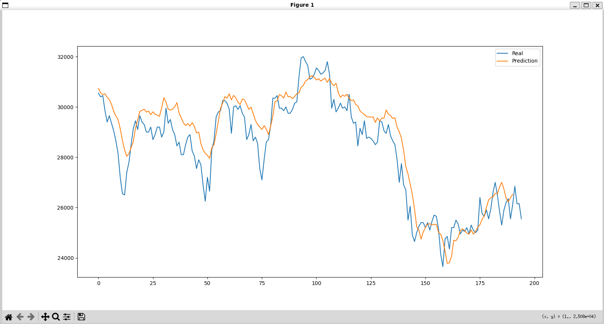

# Stock Prediction Project
This repo provides the source code & data of Stock Prediction Project.

## 🧐 Overview for the base project

**Highlights**:
- 📈 We analyze a structured/unstructured data and visualize them with python tools.
- 💡 We propose a deep learning methods that employs stock price and text data for Stock Prediction.
- 🔝 We used RMSE metric to evaluate our new deep learning stock prediction method.

  

## 🌟 Dataset
**Highlights**:
- 📖 All data and crawling process is based on 2022 stock data of Korean Airlines Co., Ltd.
- You can download dataset from the [link](https://drive.google.com/drive/folders/1dE_oZYd_YrP_1h5XxDTGJmVC2FZd03Cg?usp=drive_link), which include stock price and news data of Korean Airlines Co., Ltd. Please put the downloaded dataset into data directory.
- 😎 Part of the code in Prediction directory has been updated to 2025 version.
